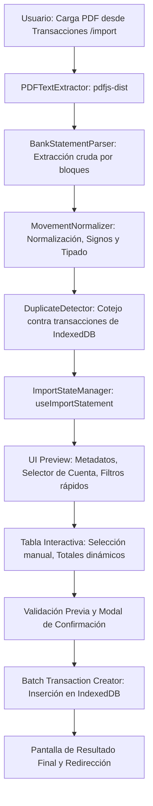

# Plan Detallado: Módulo de Importación de Movimientos Bancarios desde PDF

## 1. Resumen Ejecutivo
El objetivo de este módulo es permitir a los usuarios importar extractos bancarios en formato PDF directamente en la aplicación de control de gastos, procesándolos 100% en el navegador del cliente mediante JavaScript (`pdfjs-dist`) sin enviar información sensible a servidores externos ni usar OCR innecesario. 

El flujo garantiza integridad de datos, detección de duplicados, selección granular y confirmación explícita antes de persistir las transacciones en IndexedDB.

---

## 2. Decisiones de Diseño y Alcance Acordados

1. **Estrategia del Parser:** Parser multipropósito con heurística y detección de columnas inteligente, con soporte optimizado para extractos de bancos de Bolivia (Banco Nacional de Bolivia - BNB, Banco de Crédito - BCP, Mercantil Santa Cruz, Banco Unión, Banco Ganadero, Banco Bisa, etc.).
2. **Cálculo de Balances y Reportes:** Al confirmar la importación, los registros se guardan como transacciones en la base de datos IndexedDB y se actualiza el estado global (`DataContext`). La aplicación calcula automáticamente los totales y balances de reportes derivados de las transacciones.
3. **Punto de Entrada en la UI:** Un botón de acción rápida con ícono de importación ubicado en la cabecera superior del listado de transacciones ([`TransactionsList.tsx`](file:///home/roy/projects/control-gastos/src/app/transactions/components/TransactionsList.tsx)), ubicado justo al lado del botón de Calendario, además de contar con su ruta dedicada `/import`.

---

## 3. Arquitectura del Módulo y Separación de Responsabilidades

El diseño sigue una arquitectura modular y desacoplada por capas:



### Componentes y Módulos a Implementar

| Capa / Módulo | Ubicación | Responsabilidad |
| :--- | :--- | :--- |
| **Extractor PDF** | `src/app/import/services/pdfExtractor.ts` | Configura el worker de `pdfjs-dist`, lee todas las páginas del buffer, extrae el texto manteniendo orden espacial `(x, y)` de las líneas. |
| **Parser Bancario** | `src/app/import/services/bankStatementParser.ts` | Identifica metadatos (titular, cuenta, período) y detecta patrones de filas de movimientos, asociando descripciones multilínea y saldos. Ignora totales, resúmenes y cabeceras repetitivas. |
| **Normalizador** | `src/app/import/services/movementNormalizer.ts` | Convierte datos al contrato `ParsedMovement`, asigna signo y tipo (`entrada`/`salida`), valida consistencia de montos numéricos. |
| **Detector de Duplicados** | `src/app/import/services/duplicateDetector.ts` | Compara movimientos normalizados contra las transacciones existentes en IndexedDB (`fecha`, `monto`, `detalle`/`documento`). |
| **Motor de Selección y Totales** | `src/app/import/services/selectionManager.ts` | Lógica pura para filtros (`all`, `none`, `incomes`, `expenses`), alternar selecciones individuales y cálculo reactivo de subtotales. |
| **Hook de Estado** | `src/app/import/hooks/useImportStatement.ts` | Orquestador de pasos (`upload` → `review` → `confirm` → `completed`), validaciones y persistencia batch. |
| **Vistas y Componentes UI** | `src/app/import/components/*` | Componentes desacoplados (`PdfDropzone`, `StatementMetadataCard`, `AccountSelector`, `FilterToolbar`, `MovementsTable`, `ImportTotalsSummary`, `ImportConfirmModal`, `ImportResultCard`). |
| **Página y Enrutamiento** | `src/pages/ImportTransactions.tsx` & `src/routes.tsx` | Página principal de importación registrada en `/import`. |

---

## 4. Modelo de Datos y Tipos TypeScript

Archivo: `src/app/import/types/index.ts`

```typescript
export type MovementType = 'entrada' | 'salida';

export interface StatementMetadata {
  titular: string | null;
  cuenta: string | null;
  producto: string | null;
  fechaDesde: string | null;
  fechaHasta: string | null;
  bancoDetectado?: string | null;
}

export interface ParsedMovement {
  id: string;              // Identificador temporal único para la UI
  fecha: string;           // Formato YYYY-MM-DD
  agencia?: string;        // Ej: "LPZ", "SCZ", "CBB"
  descripcion: string;     // Concepto o glosa limpia
  documento?: string;      // Nro de documento o transacción
  monto: number;           // Positivo para entrada, negativo para salida
  saldo?: number;          // Saldo posterior reportado en el extracto
  tipo: MovementType;      // 'entrada' si monto > 0, 'salida' si monto < 0
  seleccionado: boolean;   // Controla si se importará
  importable: boolean;     // true si los datos son válidos
  duplicado?: boolean;     // true si ya existe un registro idéntico
  error?: string;          // Descripción del error en caso de fallo de parsing
}

export interface ImportSummary {
  encontrados: number;
  seleccionados: number;
  entradasTotal: number;
  salidasTotal: number;
  cantidadEntradas: number;
  cantidadSalidas: number;
  duplicados: number;
  errores: number;
}

export type ImportStep = 'upload' | 'review' | 'confirm' | 'completed';

export interface ImportState {
  file: File | null;
  isProcessing: boolean;
  step: ImportStep;
  selectedAccountId: string;
  metadata: StatementMetadata;
  movements: ParsedMovement[];
  summary: ImportSummary;
  error: string | null;
}

export interface FinalImportResult {
  importados: number;
  omitidos: number;
  duplicados: number;
  errores: number;
}
```

---

## 5. Estrategia de Extracción y Parsing (`pdfjs-dist`)

### 5.1 Configuración de Worker en Vite
Configuración para asegurar compatibilidad con bundles de Vite y PWA:
```typescript
import * as pdfjsLib from 'pdfjs-dist';
import pdfjsWorker from 'pdfjs-dist/build/pdf.worker.min.mjs?url';

pdfjsLib.GlobalWorkerOptions.workerSrc = pdfjsWorker;
```

### 5.2 Extracción de Texto Multilínea y Espacial
1. Leer secuencialmente todas las páginas del archivo `ArrayBuffer`.
2. Para cada página, obtener los elementos de texto (`page.getTextContent()`).
3. Agrupar los fragmentos por línea según su posición vertical (coordenada `Y`) y ordenarlos de izquierda a derecha (coordenada `X`).
4. Generar un flujo de líneas continuo que soporte extractos de múltiples páginas donde las transacciones continúen de una página a la siguiente sin corte abrupto.

### 5.3 Lógica del Parser Inteligente
1. **Extracción de Metadatos:**
   * Detección de Titular (`Titular: ...`, `Nombre: ...`, `Cliente: ...`).
   * Detección de Cuenta Bancaria (`Cuenta: ...`, `Nro. Cuenta: ...`, `Cta. Cte. / Cta. Ahorro`).
   * Rango de Fechas (`Desde: DD/MM/AAAA Hasta: DD/MM/AAAA` o `Período: ...`).
2. **Ignorar Secciones de Ruido y Footers:**
   * Cabeceras de columnas repetitivas (`Fecha Movimiento AG Descripción Nro Documento Monto Saldo`).
   * Bloques de totales y resúmenes (`Total Créditos`, `Total Débitos`, `Tránsito`, `Consultado`, `Congelado`, `Sobregirado`, `Disponible`, `Total`).
   * Información de pie de página (números de página, firmas, sellos de agua).
3. **Parseo de Líneas de Movimiento:**
   * Identificar líneas que inician con patrón de fecha (`DD/MM/YYYY`, `DD-MM-YYYY`, `DD/MM/YY`).
   * Capturar Agencia (ej: código alfabético de 3 letras como `LPZ`, `SCZ`, `CBBA`, `ORU`, `PTS`, `TJA`, `BEN`, `PAN`, `CHQ`).
   * Capturar Nro de Documento / Transacción (numérico o alfanumérico).
   * Capturar Montos y Saldos con normalización de formatos numéricos bolivianos (`1.234,56` o `1,234.56`).
   * Asociar líneas de descripción adicionales o saldos en líneas secundarias antes del siguiente movimiento.
4. **Resguardo de Integridad:**
   * Si una línea parece ser un movimiento pero tiene datos inconsistentes, se incluye con `importable: false` y mensaje de error explícito para que el usuario esté informado.

---

## 6. Detección de Posibles Duplicados

Al cargar y revisar los movimientos:
1. Se consulta el historial de transacciones en IndexedDB (`transactionRepo.getAll()`).
2. Se evalúa la coincidencia por:
   * Misma fecha (`date === m.fecha`).
   * Mismo monto absoluto (`amount === Math.abs(m.monto)` y mismo tipo de movimiento).
   * Mismo detalle / número de documento (`detail` contiene `m.documento` o descripción coincidente).
3. Si se detecta duplicado:
   * Se marca con `duplicado: true`.
   * Se inicializa con `seleccionado: false` para evitar importaciones accidentales.
   * Se muestra con un distintivo visual "Posible duplicado" en la tabla.

---

## 7. Acciones Rápidas de Selección y Totales Dinámicos

La manipulación de selección es reactiva y puramente funcional:

| Acción | Comportamiento |
| :--- | :--- |
| **Todos** | Marca `seleccionado: true` en todos los movimientos con `importable: true`. |
| **Ninguno** | Marca `seleccionado: false` en todos los registros. |
| **Solo Entradas** | Marca `seleccionado: true` solo a los registros con `monto > 0` e `importable: true`. |
| **Solo Salidas** | Marca `seleccionado: true` solo a los registros con `monto < 0` e `importable: true`. |
| **Selección Individual** | Checkbox por fila para incluir/excluir cualquier movimiento manualmente. |

Panel de Totales Dinámicos en tiempo real:
* **Cantidad Seleccionada:** Número de transacciones marcadas.
* **Total Entradas Seleccionadas:** Suma de montos positivos marcados.
* **Total Salidas Seleccionadas:** Suma de montos negativos marcados (en positivo para visualización clara).
* **Balance Neto Proyectado:** Diferencia neta entre entradas y salidas a registrar.

---

## 8. Flujo de Confirmación y Persistencia

1. **Validaciones Previas a la Confirmación:**
   * Existencia de archivo PDF procesado.
   * Cuenta de la aplicación seleccionada obligatoriamente (`selectedAccountId`).
   * Al menos 1 movimiento seleccionado con `importable: true`.
2. **Modal de Confirmación Detallado:**
   * Muestra la cuenta destino seleccionada.
   * Conteo y total de Entradas.
   * Conteo y total de Salidas.
   * Mensaje de confirmación explícita.
3. **Persistencia Batch:**
   * Filtrar únicamente los movimientos que cumplan `m.seleccionado && m.importable`.
   * Transformar cada movimiento al formato de `Transaction`:
     ```typescript
     {
       id: `${Date.now()}_${index}_${Math.random().toString(36).substring(2, 7)}`,
       type: m.monto > 0 ? 'entrada' : 'salida',
       date: m.fecha,
       detail: m.documento ? `[Doc: ${m.documento}] ${m.descripcion}` : m.descripcion,
       amount: Math.abs(m.monto),
       accountId: selectedAccountId,
       labels: []
     }
     ```
   * Insertar en bloque con `transactionRepo.putMany(newTransactions)`.
   * Actualizar el estado global en `DataContext` para reflejar inmediatamente los nuevos movimientos en toda la aplicación (listados, reportes y flujo de cuentas).
4. **Pantalla de Resultado Final:**
   * Reporta cantidad de movimientos importados, descartados y duplicados omitidos.
   * Botón para ir al Listado de Transacciones o importar otro extracto.

---

## 9. Integración en la Interfaz de Usuario (UI)

### 9.1 Botón de Acceso en Transacciones
En [`TransactionsList.tsx`](file:///home/roy/projects/control-gastos/src/app/transactions/components/TransactionsList.tsx), junto al botón de Calendario en la cabecera:
```tsx
<Link
  to="/import"
  className="p-2 rounded-lg text-gray-600 dark:text-gray-400 hover:bg-gray-100 dark:hover:bg-gray-800 transition-colors"
  title="Importar extracto bancario PDF"
>
  <Upload className="w-5 h-5" />
</Link>
```

### 9.2 Pantalla `/import`
* Barra de navegación superior con botón de regreso a Transacciones.
* Soporte temático completo con Tailwind CSS (Modo Claro / Modo Oscuro).
* Pasos visuales claros e interactivos.

---

## 10. Fases de Ejecución

- [x] **Fase 1: Configuración y Servicios Core**
  - [x] Instalar paquete `pdfjs-dist`.
  - [x] Crear tipos en `src/app/import/types/index.ts`.
  - [x] Implementar `pdfExtractor.ts` y worker Vite.
  - [x] Implementar `bankStatementParser.ts` con heurística para bancos bolivianos.
  - [x] Implementar `movementNormalizer.ts`.
- [x] **Fase 2: Lógica de Duplicados, Selección y Contexto**
  - [x] Implementar `duplicateDetector.ts`.
  - [x] Implementar `selectionManager.ts`.
  - [x] Implementar hook `useImportStatement.ts`.
  - [x] Agregar soporte de inserción batch en `DataContext` / `DataProvider`.
- [x] **Fase 3: Componentes Visuales del Módulo**
  - [x] Componente `PdfDropzone.tsx`.
  - [x] Componente `StatementMetadataCard.tsx`.
  - [x] Componente `AccountSelector.tsx`.
  - [x] Componente `FilterToolbar.tsx`.
  - [x] Componente `MovementsTable.tsx`.
  - [x] Componente `ImportTotalsSummary.tsx`.
  - [x] Componente `ImportConfirmModal.tsx`.
  - [x] Componente `ImportResultCard.tsx`.
- [x] **Fase 4: Rutas y Navegación**
  - [x] Crear página `src/pages/ImportTransactions.tsx`.
  - [x] Registrar ruta `/import` en `src/routes.tsx`.
  - [x] Agregar botón de importación junto al calendario en `TransactionsList.tsx`.
- [x] **Fase 5: Pruebas de Integración y Verificación**
  - [x] Probar lectura de extractos multilínea y multipágina.
  - [x] Validar cálculos de totales y filtros rápidos.
  - [x] Probar inserción batch y refresco reactivo de reportes.
